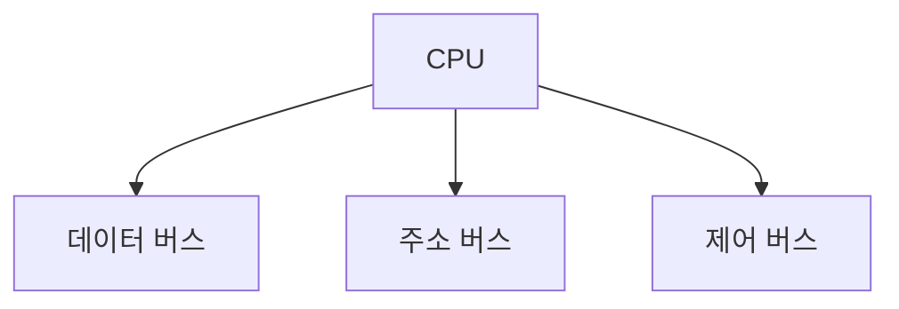

# 01. 정보시스템의 범위 및 이해

<br>

## CPU

### 1. CPU란?
- **중앙 처리장치**
- 명령어를 **해석**하고 **실행**
- 모든 **계산** 및 **제어** 담당

### 2. CPU 구성요소
- **연산장치 (ALU)**: 산술 및 논리 연산 수행
- **제어장치 (Control Unit)**: 명령어 해석 및 실행 순서 제어
- **레지스터 (Register)**: 고속 데이터 저장 공간

### 3. 내부 레지스터 종류
- **프로그램 카운터 (PC)**: 다음 실행 명령어의 주소 저장
- **명령어 레지스터 (IR)**: 현재 실행 중인 명령어 저장
- **메모리 주소 레지스터 (MAR)**: 읽거나 쓸 메모리 주소 저장
- **메모리 버퍼 레지스터 (MBR)**: 메모리에서 읽거나 쓰는 데이터 임시 저장
- **누산기 (ACC)**: 연산 결과 저장

### 4. 버스 시스템
- **데이터 버스**: 데이터 이동
- **주소 버스**: 메모리 주소 지정
- **제어 버스**: 제어 신호 전달



### 5. CPU 명령 실행 주기
- **Fetch**: 명령어 가져오기
- **Indirect**: 간접 주소 처리
- **Execute**: 명령어 실행
- **Interrupt**: 외부 요청 처리

<br>

## 메모리 시스템

### 1. 기억장치 계층 구조
```mermaid
graph TD
    A[레지스터 (가장 빠름, 작음)] --> B[캐시 메모리]
    B --> C[주기억장치 (RAM)]
    C --> D[보조기억장치 (HDD/SSD)]
    D --> E[외부 기억장치 (USB/Cloud)]
```

### 2. 캐시 메모리
- **CPU와 메모리 간 속도 차이를 줄이는 고속 메모리**
- **계층 구조**:
  - L1: CPU 내부, 가장 빠름
  - L2: CPU 근처, 속도 중간
  - L3: 여러 코어 공유, 속도 느림

### 3. 캐시 메모리 관리 방식
#### 매핑 방식
- **직접 매핑**: 고정된 캐시 블록에 데이터 저장
- **완전 연관 매핑**: 모든 캐시 블록에 데이터 저장 가능
- **집합 연관 매핑**: 특정 집합 내에서 저장

#### 교체 알고리즘
- **FIFO**: 가장 먼저 들어온 데이터를 교체
- **LRU**: 가장 오래 사용되지 않은 데이터를 교체
- **SCR (Second Chance Replacement)**: 참조 비트 활용하여 교체

### 4. 캐시 메모리 일관성
- **스누핑 (Snooping)**: 버스 모니터링으로 데이터 일치 유지
- **디렉토리 기반**: 중앙 디렉토리에서 데이터 상태 관리

### 5. 가상 메모리 시스템
- **개념**: 실제 메모리보다 큰 공간을 제공하는 기술
- **관리 단위**:
  - **페이지**: 고정 크기 단위로 나눔
  - **세그먼트**: 가변 크기 단위로 나눔

#### 할당 정책
- **고정 할당**: 정해진 크기의 메모리 공간 할당
- **가변 할당**: 프로그램 요구에 따라 동적으로 할당

#### 관리 기법
- **페이징**: 고정 크기로 나눠 관리
- **세그멘테이션**: 논리적 단위로 관리
- **페이지드 세그멘테이션**: 세그먼트를 다시 페이지로 나눔

<br>

## I/O 인터페이스

### 1. DMA (Direct Memory Access)
- CPU를 거치지 않고 I/O 장치가 직접 메모리와 데이터 교환
- **장점**: CPU의 부담 감소, 빠른 데이터 처리

### 2. I/O Processor
- 독립적으로 I/O 작업을 처리하는 프로세서
- CPU의 I/O 작업을 대신 수행하여 효율성 증가

```mermaid
graph TD
    CPU -->|명령 전송| IOP
    IOP -->|데이터 처리| Memory
    IOP -->|데이터 처리| I/O Devices
```

<br>

[nodejs]: https://nodejs.org/
[starter]: https://github.com/cotes2020/chirpy-starter
[pages-workflow-src]: https://docs.github.com/en/pages/getting-started-with-github-pages/configuring-a-publishing-source-for-your-github-pages-site#publishing-with-a-custom-github-actions-workflow
[latest-tag]: https://github.com/cotes2020/jekyll-theme-chirpy/tags
