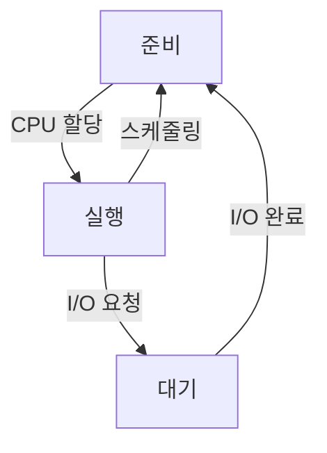
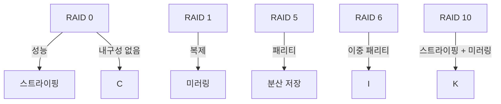

# 02. 운영체제 구조 정리

 

## 운영체제 개요

### 1. 운영체제 정의
- **시스템 소프트웨어**
- 하드웨어와 사용자 간 **중재 역할** 수행
- 사용자와 프로그램이 시스템 자원을 효율적으로 사용하도록 지원

### 2. 운영체제 목적
- **자원 관리**: CPU, 메모리, 저장장치 등 자원의 효율적 사용
- **사용자 인터페이스 제공**: 명령 줄, GUI 등 사용자 편의 제공
- **시스템 성능 최적화**

### 3. 운영체제 분류
- **단일 작업**: 한 번에 하나의 작업 처리
- **다중 작업**: 여러 작업 동시 처리
- **단일 사용자**: 하나의 사용자만 지원
- **다중 사용자**: 여러 사용자가 동시 사용 가능
- **분산 운영체제**: 네트워크로 연결된 여러 시스템 관리

### 4. 주요 자원 관리 기능
- **프로세스 관리**: 실행 중인 프로그램 관리
- **메모리 관리**: 프로그램이 사용하는 메모리 공간 할당 및 회수
- **파일 시스템 관리**: 데이터 저장 및 접근 지원
- **입출력 관리**: 장치와 데이터 교환

 

## 프로세스 관리

### 1. 프로세스와 스레드
- **프로세스**: 실행 중인 프로그램
- **스레드**: 프로세스 내에서 실행되는 작업 단위 (경량 프로세스)

### 2. 프로세스 상태
- **상태**: 준비(Ready), 실행(Running), 대기(Waiting)
- **상태 전이**:
  - 준비 → 실행: CPU 할당
  - 실행 → 대기: I/O 요청 발생
  - 대기 → 준비: I/O 완료
  - 실행 → 준비: 스케줄러에 의해 CPU 반환

### 3. 문맥 교환
- **정의**: 실행 중인 프로세스를 중단하고 다른 프로세스를 실행하는 작업
- **과정**: 현재 프로세스 상태 저장 → 새 프로세스 상태 복원

 

## CPU 스케줄링 기법

### 1. 정의와 목적
- **정의**: CPU를 어떤 프로세스가 사용할지 결정하는 작업
- **목적**: 시스템 자원 최적화, 응답 시간 단축, 공정성 보장

### 2. 스케줄러 점유 방식
- **선점(Preemptive)**: 실행 중인 프로세스를 중단 가능
- **비선점(Non-preemptive)**: 실행 중인 프로세스를 중단하지 않음

### 3. 스케줄링 기법
- **FCFS (First Come First Serve)**: 먼저 도착한 프로세스부터 실행
- **SJF (Shortest Job First)**: 실행 시간이 가장 짧은 프로세스 우선
- **Round Robin**: 고정 시간 할당 후 순환 처리
- **SRT (Shortest Remaining Time)**: 남은 실행 시간이 가장 짧은 프로세스 우선
- **Multi-level Queue**: 우선순위에 따라 프로세스를 여러 큐로 분류
- **Multi-level Feedback Queue**: 작업 특성에 따라 큐 이동 허용

 

## 병행성 제어

### 1. 상호배제
- 하나의 프로세스만 임계영역에 접근 가능

### 2. 임계영역 문제
- **구조**:

| 프로세스 | 코드 | 설명 |
|----------|-------|------|
| P1       | 진입  | 임계영역 접근 시도 |
|          | 실행  | 임계영역에서 작업 수행 |
|          | 종료  | 임계영역 벗어남 |

### 3. 병행 제어 기법
- **세마포어**: 접근 제어를 위한 정수 값 사용
- **모니터**: 고급 언어 기반 상호배제 제공

### 4. 교착상태
- **발생 조건**: 상호배제, 점유 및 대기, 비선점, 순환 대기
- **대응 방법**:
  - 예방: 발생 조건 제거
  - 회피: 안전 상태 유지
  - 발견: 교착상태 탐지
  - 회복: 프로세스 강제 종료

 

## 장치 관리

### 1. 디스크 관리
- 디스크 저장 공간 효율적 관리

### 2. 디스크 스케줄링 기법
- **FCFS**: 요청 순서대로 처리
- **SSTF**: 가장 짧은 탐색 시간 우선
- **SCAN**: 디스크 끝까지 이동하며 요청 처리
- **C-SCAN**: 한 방향으로만 이동하며 요청 처리

 

## 파일 시스템
- **구조**: 파일 이름, 데이터, 속성 포함
- **기능**: 데이터 저장, 검색, 접근 제어

 

## RAID (중요)

### 1. 정의
- **Redundant Array of Independent Disks**
- 여러 디스크를 하나처럼 사용하여 성능 향상 및 데이터 안전성 보장

### 2. RAID 레벨
- **RAID 0**: 데이터 스트라이핑, 성능 향상, 장애 내구성 없음
- **RAID 1**: 데이터 미러링, 데이터 복제, 높은 내구성
- **RAID 5**: 데이터와 패리티 분산 저장, 성능과 내구성 균형
- **RAID 6**: 추가 패리티 저장, RAID 5보다 높은 내구성
- **RAID 10**: 스트라이핑 + 미러링, 성능과 내구성 모두 강화

 

[nodejs]: https://nodejs.org/
[starter]: https://github.com/cotes2020/chirpy-starter
[pages-workflow-src]: https://docs.github.com/en/pages/getting-started-with-github-pages/configuring-a-publishing-source-for-your-github-pages-site#publishing-with-a-custom-github-actions-workflow
[latest-tag]: https://github.com/cotes2020/jekyll-theme-chirpy/tags
